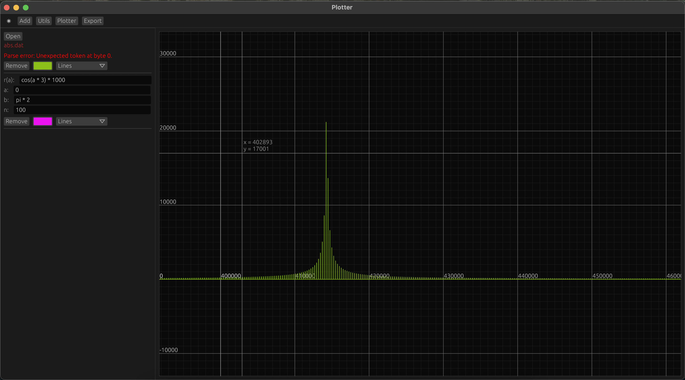
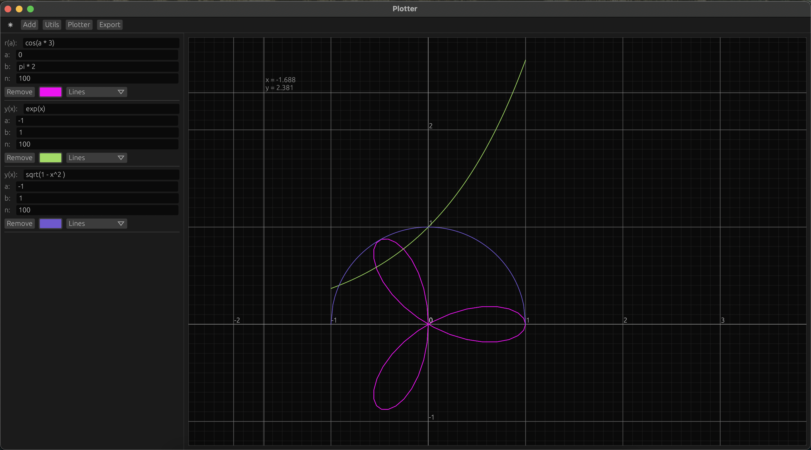

# Plotter

## Why?

This project is inspired by GNUplot. Plotter is an alternative intended to be more stable and have moder gui interface.

## Features

* Data plotting
* Polars and parametric plotting
* Multiple plots
* Colors and styles
* Over 100 000 points support realtime
* Function evaluator supports constants like e and pi, trigonometric functions like sin, cos, ets.

## TODO

* 3d plotting
* Export to svg and png
* Command line support

## Pictures

